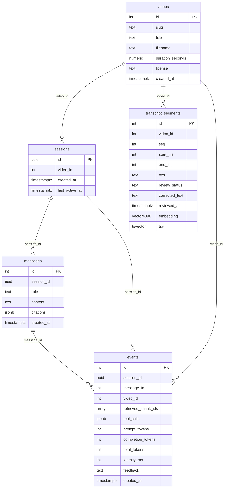

<!-- AUTO-GENERATED by scripts/gen-schema-doc.py — do not hand-edit. -->
<!-- Regenerate after any change under db/migrations/, then commit -->
<!-- the result. CI (pr-validation.yml, `migrations` job) checks   -->
<!-- this file for drift against a freshly-migrated database.     -->

# Database schema

Generated from the tables that exist after applying every migration
in [`db/migrations/`](../db/migrations/) in order. The migrations
themselves (each has a comment explaining *why*) are the source of
truth — this file is a reflection of them for quick reference, not
a second place to hand-edit the schema.

## ER diagram

## Tables

### `events`

| Column | Type | Nullable | Default | Notes |
|---|---|---|---|---|
| `id` | `integer` | no | `nextval('events_id_seq'::regclass)` | PK |
| `session_id` | `uuid` | no | — | FK → `sessions.id` (ON DELETE CASCADE) |
| `message_id` | `integer` | yes | — | FK → `messages.id` (ON DELETE SET NULL) |
| `video_id` | `integer` | yes | — | FK → `videos.id` (ON DELETE SET NULL) |
| `retrieved_chunk_ids` | `integer[]` | no | `'{}'::integer[]` | — |
| `tool_calls` | `jsonb` | no | `'[]'::jsonb` | — |
| `prompt_tokens` | `integer` | yes | — | — |
| `completion_tokens` | `integer` | yes | — | — |
| `total_tokens` | `integer` | yes | — | — |
| `latency_ms` | `integer` | no | — | — |
| `feedback` | `text` | yes | — | — |
| `created_at` | `timestamp with time zone` | no | `now()` | — |

Check constraints:
- `((feedback = ANY (ARRAY['up'::text, 'down'::text])))`

Indexes:
- `CREATE UNIQUE INDEX idx_events_message ON public.events USING btree (message_id)`
- `CREATE INDEX idx_events_session ON public.events USING btree (session_id, id)`

### `messages`

| Column | Type | Nullable | Default | Notes |
|---|---|---|---|---|
| `id` | `integer` | no | `nextval('messages_id_seq'::regclass)` | PK |
| `session_id` | `uuid` | no | — | FK → `sessions.id` (ON DELETE CASCADE) |
| `role` | `text` | no | — | — |
| `content` | `text` | no | — | — |
| `citations` | `jsonb` | yes | — | — |
| `created_at` | `timestamp with time zone` | no | `now()` | — |

Check constraints:
- `((role = ANY (ARRAY['user'::text, 'assistant'::text])))`

Indexes:
- `CREATE INDEX idx_messages_session ON public.messages USING btree (session_id, id)`

### `sessions`

| Column | Type | Nullable | Default | Notes |
|---|---|---|---|---|
| `id` | `uuid` | no | `gen_random_uuid()` | PK |
| `video_id` | `integer` | yes | — | FK → `videos.id` (ON DELETE SET NULL) |
| `created_at` | `timestamp with time zone` | no | `now()` | — |
| `last_active_at` | `timestamp with time zone` | no | `now()` | — |

### `transcript_segments`

| Column | Type | Nullable | Default | Notes |
|---|---|---|---|---|
| `id` | `integer` | no | `nextval('transcript_segments_id_seq'::regclass)` | PK |
| `video_id` | `integer` | no | — | FK → `videos.id` (ON DELETE CASCADE) |
| `seq` | `integer` | no | — | — |
| `start_ms` | `integer` | no | — | — |
| `end_ms` | `integer` | no | — | — |
| `text` | `text` | no | — | — |
| `review_status` | `text` | no | `'unreviewed'::text` | — |
| `corrected_text` | `text` | yes | — | — |
| `reviewed_at` | `timestamp with time zone` | yes | — | — |
| `embedding` | `vector(4096)` | yes | — | — |
| `tsv` | `tsvector` | yes | — | — |

Check constraints:
- `((review_status = ANY (ARRAY['unreviewed'::text, 'correct'::text, 'incorrect'::text])))`

Unique constraints: `(video_id, seq)`

Indexes:
- `CREATE INDEX idx_transcript_segments_tsv ON public.transcript_segments USING gin (tsv)`
- `CREATE INDEX idx_transcript_segments_video_start ON public.transcript_segments USING btree (video_id, start_ms)`
- `CREATE UNIQUE INDEX transcript_segments_video_id_seq_key ON public.transcript_segments USING btree (video_id, seq)`

### `videos`

| Column | Type | Nullable | Default | Notes |
|---|---|---|---|---|
| `id` | `integer` | no | `nextval('videos_id_seq'::regclass)` | PK |
| `slug` | `text` | no | — | — |
| `title` | `text` | no | — | — |
| `filename` | `text` | no | — | — |
| `duration_seconds` | `numeric` | no | — | — |
| `license` | `text` | yes | — | — |
| `created_at` | `timestamp with time zone` | no | `now()` | — |

Unique constraints: `(slug)`

Indexes:
- `CREATE UNIQUE INDEX videos_slug_key ON public.videos USING btree (slug)`
